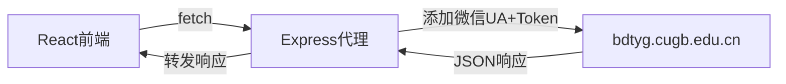

## 1. 架构设计

```mermaid
flowchart TB
    subgraph "前端 (React + Vite)"
        A[登录页] --> B[场地查询页]
        A --> C[自动抢场页]
        B --> D[API服务层]
        C --> D
    end
    subgraph "后端代理 (Express)"
        D --> E[/api/proxy]
        E --> F[添加微信UA + Token转发]
    end
    subgraph "外部服务"
        F --> G[bdtyg.cugb.edu.cn]
    end
```

## 2. 技术说明
- 前端: React@18 + tailwindcss@3 + vite + zustand
- 初始化工具: vite-init
- 后端: Express@4 (代理服务器，用于转发API请求并添加微信User-Agent头)
- 数据库: 无（使用localStorage存储Token和抢场配置）

## 3. 路由定义
| 路由 | 用途 |
|------|------|
| /login | 登录页，输入Token验证身份 |
| /booking | 场地查询和预约页 |
| /auto-grab | 自动抢场配置和监控页 |

## 4. API定义

### 4.1 后端代理API
| 代理路由 | 目标API | 方法 | 说明 |
|----------|---------|------|------|
| POST /api/login/wxLogin | /service/appointment/appointment/phone/login/wxLogin | POST | 微信登录 |
| POST /api/getUserInfo | /service/appointment/appointment/userAddress/getUserInfo | POST | 获取用户信息 |
| POST /api/checkBlackList | /service/appointment/appointment/phone/checkBlackList | POST | 黑名单检查 |
| POST /api/getBookingNode | /service/appointment/appointment/phone/getBookingNode | POST | 获取场馆类型列表 |
| POST /api/bookingByTime | /service/appointment/appointment/phone/bookingByTime | POST | 查询场地空位 |
| POST /api/getPayPrice | /service/appointment/appointment/phone/getPayPrice | POST | 获取预约价格 |
| POST /api/getPaywayList | /service/appointment/appointment/phone/getPaywayList | POST | 获取支付方式 |
| POST /api/payOrderForPhone | /service/appointment/appointment/phone/payOrderForPhone | POST | 提交预约订单 |
| POST /api/getBookInstruction | /service/appointment/appointment/phone/getBookInstruction | POST | 获取预约须知 |
| POST /api/getPhoneHome | /service/appointment/appointment/phone/getPhoneHome | POST | 获取首页信息 |
| POST /api/getSchoolSelect | /service/appointment/appointment/phone/getSchoolSelect | POST | 获取学校列表 |
| POST /api/getGuaranteeJurisdiction | /service/appointment/appointment/phone/getGuaranteeJurisdiction | POST | 保证金权限 |
| POST /api/baoPeerLogic | /service/appointment/appointment/phone/baoPeerLogic | POST | 同伴逻辑 |
| POST /api/getChildren | /service/appointment/appointment/phone/getChildren | POST | 获取子节点 |
| POST /api/getUserAddressList | /service/appointment/appointment/userAddress/getUserAddressList | POST | 获取用户地址 |
| POST /api/getChargedJurisdiction | /service/appointment/appointment/phone/getChargedJurisdiction | POST | 收费权限 |
| POST /api/getSysBannerInfo | /service/appointment/appointment/phone/getSysBannerInfo | POST | 获取轮播图 |

### 4.2 核心API请求格式

所有API请求需携带:
- Header: `token: <JWT_TOKEN>`
- Header: `Content-Type: application/json`
- Header: `User-Agent` 包含微信标识
- Body: `{"item": "<加密参数>"}`

**bookingByTime 请求体（加密前）**:
```json
{
  "nodeid": "889772856316272640",
  "reserveDate": "2026-04-23"
}
```

**bookingByTime 响应**:
```typescript
interface BookingResponse {
  success: boolean;
  resultData: {
    timeList: Array<{time: string; status: string}>;  // status: 0=可约, 1=不可约
    nodeList: Array<{sitename: string; nodeid: string}>;
    priceList: Array<{price: string; x: number; y: number}>;
    bookingstartdate: string;
    bookingstarttime: string;  // "07:30"
    mintimeselect: string;
    maxAppointmentNodeNum: string;
    conflictList: any[];
    start: string;
    isNew: boolean;
    venueArray: any[];
  }
}
```

### 4.3 关键数据
- 羽毛球 nodeid: `889772856316272640`
- orgid: `2`
- 场地列表: 1号场~10号场 (nodeid: 890407839460499456 ~ 897321924424900608)
- 时段: 09:00-22:00 (status 0=可约, 1=不可约)
- 价格: 白天(09:00-18:00) 10元/小时, 晚上(19:00-22:00) 40元/小时
- 预约开始时间: 07:30
- 可预约3天内场地

## 5. 服务器架构图



## 6. 数据模型

### 6.1 本地存储模型 (localStorage)
```typescript
interface AppStorage {
  token: string;                    // JWT Token
  userInfo: {                       // 用户信息
    idserial: string;
    tel: string;
    username: string;
  };
  autoGrabConfig: {                 // 自动抢场配置
    enabled: boolean;
    targetDate: string;             // 目标日期 YYYY-MM-DD
    nodeid: string;                 // 场地ID
    sitename: string;               // 场地名称
    timeSlots: string[];            // 时段列表 ["19:00","20:00"]
    executeAt: string;              // 执行时间 "07:30"
  };
  grabLogs: Array<{                 // 抢场日志
    timestamp: string;
    message: string;
    success: boolean;
  }>;
}
```

### 6.2 DDL
不适用（无数据库）
